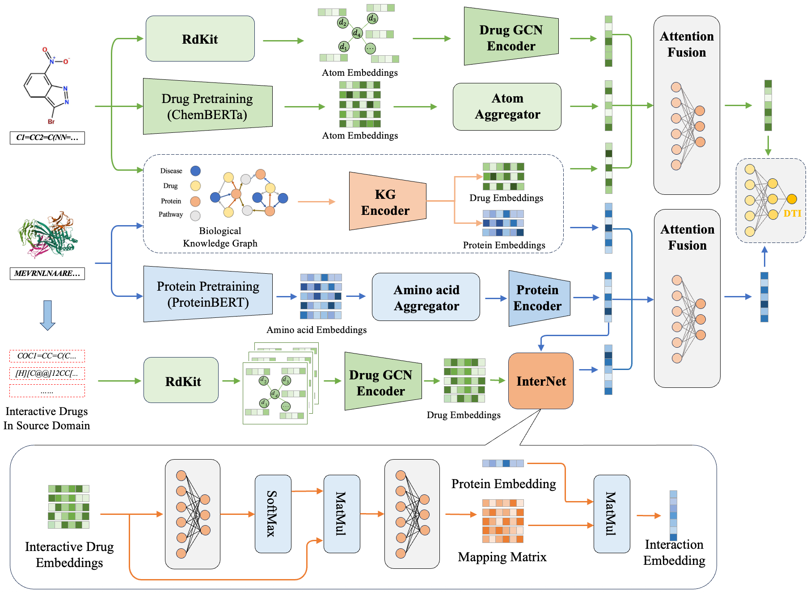
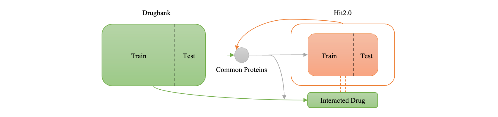

# Target identification of TCM’s compounds via cross-domain multi-modal transfer learning

## 1. Introduction

This repository contains source code and datasets for "[Target identification of TCM’s compounds via cross-domain multi-modal transfer learning]()".

In this study, we proposed a cross-domain multimodal transfer learning method to identify chemical compounds as drug targets (called CMTarget) for efficient and accurate prediction of drug-protein interactions.

## 2. Overview


Fig1. Overview of drug repositioning framework.

## 3. Install Python libraries needed

```
conda create -n CMTarget python=3.9
pip3 install torch torchvision torchaudio --index-url https://download.pytorch.org/whl/cu118
pip install pandas
pip install matplotlib
pip install -U scikit-learn
pip install tqdm
pip install transformers
conda install -c conda-forge rdkit
```

## 4. Basic Usage

### (1) Prepare the dataset
Our dataset is placed in the directory *./data/dataset/*. Currently, there are two domains of data in this directory, namely drugbank and hit. drugbank is for Western medicine data, and hit is for traditional Chinese medicine data. Each field contains a csv file, which has three columns: one column is the protein molecule sequence, one column is the compound molecule sequence, and one column is whether there is an interaction relationship between the compound and the protein. Our project further processed the data of the source domain and the target domain. We extracted the common proteins of the source domain and the target domain, and respectively identified the compounds that these proteins interacted with in the source domain and the target domain to form new datasets. The csv file of the new dataset contains four columns. One column is the common protein sequence, one column is the compound sequence of the target domain, one column is whether there is an interaction relationship between the compound and the protein, and the last column is all the interactions of the protein in the source domain. The following command can be used to generate data in the required data format for this project.  


Fig2. Schematic diagram of data division

```
python main.py --task split -s drugbank -t hit -d cdr -hl 40
```

### (2) Train the model

If it is the first time to run the code, the pre-trained model and the knowledge graph model need to be called first to extract the vector representations of compounds and proteins. Please download [prot_bert](https://huggingface.co/Rostlab/prot_bert/tree/main) and [ChemBERTa-zinc-base-v1](https://huggingface.co/seyonec/ChemBERTa-zinc-base-v1) to your local device and store them in directory *./model_hub*. You need to execute the following code before starting training the model. 

```
python main.py --task extract -s drugbank -t hit
```

Start training the model.

```
python main.py --task train -s drugbank -t hit -m CMTarget -hl 40 -e 100 -nw 16
```

### (3) Load model to predict the interaction between proteins and compounds

```
python main.py --task predict -s drugbank -t hit -m CMTarget -mp [model path]
```

## 5. Citation and Contact

```
@article{dong2024presrecst,
  title={Target identification of TCM’s compounds via cross-domain multi-modal transfer learning},
  author={},
  journal={},
  volume={},
  number={},
  pages={},
  year={},
  publisher={}
}
```

<b>If you have better suggestions or questions about our work, please contact us: <a>*kuoyang@bjtu.edu.cn*</a>. </b> 

<b>Welcome to follow our project on GitHub: <a>https://github.com/Tangerti/CMTarget#</a>. </b>